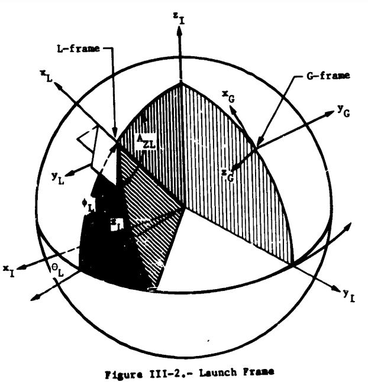
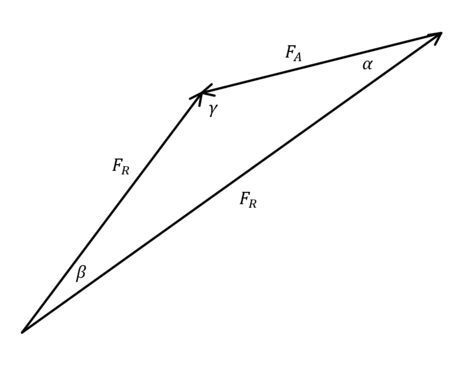

# User Manual

This program is an adaptation of the [Program to Optimize Simulated Trajectories (POST)](https://ntrs.nasa.gov/api/citations/19750024073/downloads/19750024073.pdf). It is a program to optimize a 3 DoF trajectory of e.g. a rocket through the atmosphere.

POST was written in 1970 by the Martin Marietta Corporation for NASA. Mainly developed to simulate the space shuttle, it was later built upon and greatly improved. Its successor, POST2, is still in use today, for example for the Artemis program or for Perseverance ([source](https://www.nasa.gov/post2/history/)).

While I tried to stay close to the original, there are a few differences and missing features, which are discussed in [Chapter 3.1](#31-differences-to-the-original). Also, as the project develops, I am planning to update the program as discussed in [Chapter 4.2](#42-planned-changes).

__Table of Content__

- [1. Overview](#1-overview)
  - [1.1. Simulation](#11-simulation)
    - [1.1.1. Coordinate Frames](#111-coordinate-frames)
    - [1.1.2. Equation of Motion](#112-equation-of-motion)
  - [1.2. Optimization](#12-optimization)
  - [1.3. Further reading](#13-further-reading)
- [2. Usage](#2-usage)
  - [2.1. Configuration File](#21-configuration-file)
- [3. Discussion](#3-discussion)
  - [3.1. Differences to the original](#31-differences-to-the-original)
    - [3.1.1. Missing Features](#311-missing-features)
    - [3.1.2. Auto-throttling](#312-auto-throttling)
  - [3.2. The programming language used: Rust](#32-the-programming-language-used-rust)
    - [3.2.1. The Good](#321-the-good)
    - [3.2.2. The Bad](#322-the-bad)
- [4. The Verdict](#4-the-verdict)
- [5. Development](#5-development)
  - [5.1. Existing Issues](#51-existing-issues)
  - [5.2. Planned Changes and other Features](#52-planned-changes-and-other-features)


## 1. Overview

This section will give an overview of the program. The program is split into two parts. The simulation and the optimization. The optimization is tweaking the parameters of the simulation and executes it repeatedly to search for the optimal trajectory.

Firstly, I will show how the simulation works in general, then I will give a few more details on the equations of motion. Next, I will give an idea on how the optimization works. Lastly, I give an overview of the original documentation, where each part is explained in detail.


### 1.1. Simulation

The simulation consists of multiple phases, each split by an event.

Each phase consists of two sets of variables: the configuration parameters and the simulation variables. The configuration parameters define the vehicle and its environment, while the simulation variables are calculated by the simulation for each time step.

| Example configuration parameters | Example simulation variables |
| -------------------------------- | ---------------------------- |
| Planet model                     | Simulation Time              |
| Wind strength / direction        | Position                     |
| Launch latitude                  | Acceleration                 |
| Vehicle structure mass           | Mass                         |
| Vehicle pitch rate               | Euler Angles                 |
| Simulation step size             | Aerodynamic Forces           |
| etc.                             |

These are described in detail in [Chapter 2](#2-usage).

Each event is always some simulation variable reaching a specified value, both of which can be defined by the user in the configuration. At the beginning of each phase, the user can define changes in the configuration.

---

The simulation executes each phase in the following way: First, the phase is initialized with the configuration and end state of the previous phase, then it is updated with its own configuration parameters.

Next, an integrator is integrating the equations of motion and the mass flow for a fixed time step. The next chapter will detail the equations of motion. In the equations of motion, the simulation state, consisting of all simulation variables, is slowly build step by step.

After each time step, the simulation checks the termination condition for the current phase. If the specified value is reached (within a margin), the phase is terminated. If the simulation overshot the termination condition, it will compute a smaller time step and redo the simulation step.


#### 1.1.1. Coordinate Frames

There are 5 coordinate frames used. These are the inertial frame, earth-relative frame, atmosphere-relative frame, launch frame and body frame.

__Inertial Frame__

The inertial frame is located at earth's center and is fixed in inertial frame. $z_i$ points towards the North Pole and the $x_i$, $z_i$ plane intersects Greenwich at time zero. 

__Earth-relative Frame__

The earth-relative frame is the same as the inertial frame at time zero, but rotates together with the earth. This means, the difference in velocity between the both frames is the earth's velocity at that point.

__Atmosphere-relative Frame__

The atmosphere-relative frame is the same as the earth-relative frame, except with an optional static wind vector added, which can be specified by the user.

__Launch frame__

The launch frame is initialized at the launch location and planar to the oblate earth's surface with $z_L$ pointing towards the North Pole, except it is rotated by the `"azimuth"` parameter specified by the user.
The launch frame is an inertial frame, meaning it does not rotate with earth. It is used as a fixed reference point for the Euler angles.




#### 1.1.2. Equation of Motion

The equations of motion are the heart of the simulation. They are simple differential equations describing the motion of the vehicle. As the program only uses 3 DoF, they only describe the translational movement
$$ 
\begin{array}{ll} 
\dot r_I &= v_I\\
\dot v_I &= [IB]^{-1}(A_{TB} + A_{AB}) + G_I,
\end{array}
$$
where $r_I$ is the position in inertial frame, $v_I$ is the velocity in inertial frame, $[IB]$ is the transformation from the inertial to the body frame, $A_{TB}$ is the acceleration due to thrust in the body frame and $A_{AB}$ is the acceleration due to aerodynamic forces in the body frame.

__Orientation__

The transformation from the inertial to the body frame $[IB]$ depends on the inertial Euler angles and the launch coordinate frame (L-Frame). The Euler angles are defined with respect to the launch frame.

The Euler angles are computed by three cubic polynomials
$$
\alpha = c_0 + c_1y + c_0y^2 + c_1y^3.
$$
The coefficients $c_i$ can be defined by the user. The variable $y$ is some simulation variable, which can be also picked by the user. Each angle (roll, yaw & pitch) has a separate polynomial and can be configured separately.

__Acceleration due to Thrust__

The thrust of each engine $T_i$ is calculated with
$$
T_i = T_{vac, i} - A_{E,i} \cdot p(h),
$$
where $T_{vac, i}$ is the vacuum thrust specified by the user, $A_{E,i}$ is the exit area specified by the engine and $p(h)$ is the atmospheric pressure at the altitude $h$, which is calculated with the atmospheric model.
The acceleration due to thrust in the body frame $A_{TB}$ is then calculated with 
$$
A_{TB} = \frac1m\sum_{i}^{N_{eng}} T_i
\begin{bmatrix}{}
    \cos i_p \cos i_p\\
    \sin i_y\\
    \cos i_y \sin i_p
\end{bmatrix}_i,
$$
where $m$ is the mass of the vehicle. $i_p$ and $i_y$ are the pitch and yaw incidence angles specified by the user for each engine, which define the angles between the thrust vector and the body frame.

Additionally, the mass flow is calculated with
$$
\dot m = \sum_{i}^{N_{eng}} T_{vac, i}\cdot I_{sp, i}\cdot g_0 ,
$$
where $g_0$ is the standard gravity.

__Acceleration due to Aerodynamic Forces__

The acceleration due to aerodynamic forces in the body frame $A_{TB}$ is calculated with 
$$
A_{AB} = \frac1mq(h)S
\begin{bmatrix}{}
    -C_A\\
    C_Y\\
    -C_N
\end{bmatrix},
$$
where $q(h)$ is the dynamic pressure at the altitude $h$, which is calculated with the atmospheric model. $S$ is the vehicle reference area specified by the user.

$C_A$ and $C_N$ are calculated with
$$
A_{AB} = \frac1mq(h)S
\begin{bmatrix}{}
    C_A\\
    C_N
\end{bmatrix} = \begin{bmatrix}{}
    \cos\alpha & -\sin\alpha\\
    \sin\alpha & \cos\alpha
\end{bmatrix}\begin{bmatrix}{}
    C_D\\
    C_L
\end{bmatrix},
$$
where $\alpha$ is the angle-of-attack. $C_D$, $C_L$ and $C_Y$ are the drag, lift, and side-force coefficients. They are specified by the user using tables.

The tables can be 1D, 2D or 3D, which are then interpolated using a simulation variable, which is also specified by the user.

__Acceleration due to Gravity__

The acceleration due to gravity is calculated with the gravity model. There are three different gravity models available:
* Spherical Model
* 1960 Fisher Model
* Smithsonian Model

Each model calculates using simple gravitational harmonics $J_i$, where $J_1 = \mu$, the earth's gravitational constant. The spherical model uses a spherical earth model and therefore only the gravitational constant $mu$. The 1969 Fisher model uses an oblate spheroid and harmonics up to $J_2$, while the Smithsonian Model includes harmonics up to $J_4$.

__Atmospheric Model__

The atmospheric model used is the 1962 U.S. standard atmosphere model with a few changes for above 90 km.


### 1.2. Optimization

The optimization algorithm is detailed in the formulation manual. A rough sketch of the algorithm is as follows:

1. First, the nominal trajectories are simulated.
2. Now, convergence is tested. If the problem converged, we found the optimal solution.
3. If not, we simulate a slightly perturbed trajectory for each independent variable.
4. With these small perturbations, the dependency of the cost function (our optimization goal) regarding the independent variables can be calculated. This is called the cost gradient.
5. The same can be done for the constraints. This is called the sensitivity matrix.
6. Next we use the cost gradient to calculate the optimization step size and direction, which is how the independent variables should be changed to optimize our problem.
7. We use the calculated step size and direction to update our independent variables.
8. Next we calculate the constraint step size and direction, which is how the independent variables should be changed to honor the constraints.
9. We use the calculated step size and direction to update our independent variables again.
10. Then, we repeat the process.


### 1.3. Further reading

The program is based on the manual published in April 1975. It includes three volumes:
* [Volume 1: Formulation manual](https://ntrs.nasa.gov/citations/19750024073)
* [Volume 2: Utilization manual](https://ntrs.nasa.gov/citations/19750024074)
* [Volume 3: Programmer's manual](https://ntrs.nasa.gov/citations/19750024075)

Volume 1 is the most important one explaining the working principle and formulas used. Volume 2 explains the usage of the original program, which includes a few bits of extra information and an example which was important for this project. Volume 3 explains the program's structure and was only used a little to get an overview.

For further explanations of this project, look into these manuals. For convenience, I included the manuals [here](../manuals/).

There also exists a [Program summary document](https://ntrs.nasa.gov/citations/19770012832) published in 1977.

Additionally, there exists a bit of documentation about the various additions, like
* [6 DoF capabilities](https://ntrs.nasa.gov/citations/19760006045) 
* [Parallelization](https://ntrs.nasa.gov/citations/20020004355)
* and interplanetary missions ([Volume 1](https://ntrs.nasa.gov/citations/19930005605), [Volume 2](https://ntrs.nasa.gov/citations/19930010932), [Volume 3](https://ntrs.nasa.gov/citations/19930005541) and [Volume 4](https://ntrs.nasa.gov/citations/19930005579)).

These were not used for this project.


## 2. Usage

The tool's usage is very basic. It consists of one executable, which needs to be called with the file path to a configuration file, which is detailed below.

Until a build pipeline is implemented, the tool needs to be build first. For this, the rust compiler and the cargo tool needs to be [installed](https://www.rust-lang.org/tools/install).

To build the tool, run `cargo build --release` in the project's directory. Then you can execute the script with `target\release\post.exe <config filepath>`.

This will write the time, position, velocity, altitude, and propellant mass for each time step to the standard output.

Alternatively, the tool can be build and executed in one command with the `cargo run` command.

__Plotting tool__

To plot the simulated trajectory, you can pipe the output to the included plotting tool. For this, Python needs to be installed. The tool was implemented with Python 3.12. Then, install the requirements with `pip install -r sim\src\utils\plot\requirements.txt`.

Then, the simulated trajectory can be piped to the plotting tool with:
```bash
target\release\post.exe <config filepath> | python sim\src\utils\plot\plot.py
```

__Example__

The original documentation also included an example trajectory for the ascent of a space shuttle type vehicle. This example is used to validate this project.

The example is included in `sim\src\utils\input.json`. It can be used as a starting point for custom configurations.

To execute the example, run:
```bash
target\release\post.exe sim\src\utils\input.json | python sim\src\utils\plot\plot.py
```


### 2.1. Configuration File

The JSON configuration file consists of an array of configurations, one for each phase. 
Each phase is inheriting the configuration of the previous phase. Then the specified parameters are overwritten.

As the first phase does not have a previous phase, there is a default phase to inherit from:

```json
[
    {
        "planet_model": "spherical",
        "atmosphere": {
            "enabled": false,
            "wind": [ 0, 0, 0 ] // in m/s
        },
        "init": {
            "latitude": 0, // in °
            "longitude": 0, // in °
            "azimuth": 0, // in °
            "altitude": 0 // in m
        },
        "vehicle": {
            "structure_mass": 0, // in kg
            "propellant_mass": 0, // in kg
            "reference_area": 0, // in m^2
            "drag_coeff": {"x": ["time", []], "data": []},
            "lift_coeff":  {"x": ["time", []], "data": []},
            "side_force_coeff":  {"x": ["time", []], "data": []},
            "engines": [
                {
                    "incidence": [ 0, 0 ], // in rad
                    "thrust_vac": 0, // in N
                    "isp_vac": 0, // in s
                    "exit_area": 0 // in m^2
                }
            ]
        },
        "max_acceleration": -1, // in m/s^2, -1 for disabling
        "steering": {
          "roll": [ "time", [ 0, 0, 0 ] ], // in °
          "yaw": [ "time", [ 0, 0, 0 ] ], // in °
          "pitch": [ "time", [ 0, 0, 0 ] ]  // in °
        },
        "stepsize": 0, // in s
        "end_criterion": [ "time", 0 ]
    },
    { ... },
    ...
]
```
Overwriting the propellant mass will also reset the consumed propellant.

Setting a parameter to `null` is the same as not specifying it, so it will not be overwritten.

__Planet model__

The planet model has 4 valid parameters: `spherical`, `fisher_1960`, `smithsonian`, or a custom model. A custom planet model must be specified with:

```json
{
  "custom": {
    "equatorial_radius": 6.3781658568e6, // in m
    "polar_radius": 6.356783832e6, // in m
    // [mu, J_2, J_3, J_4]
    "gravitational_parameters": [
        1.3077457350581376e15, // in m^3/s^2
        1.082639e-3,
        -2.565e-6,
        -1.608e-6,
    ],
    "rotation_rate": 7.29211e-5, // in rad/s
  }
}
```

> Here, the Smithsonian model implementation is shown.

__Steering__

The steering configuration are the coefficients $c_i$ for a cubic polynomial of the form
$$
\alpha = c_0 + c_1y + c_0y^2 + c_1y^3.
$$
The first coefficient $c_0$ is initialized as zero for the first phase. For later phases, it is initialized as the last Euler angle of the previous phase. This is done to avoid jumps in the orientation.

The variable $y$ is any simulation variable. Following variables are defined:

__Simulation Variables__

| Parameter                   | Description                                   |
| --------------------------- | --------------------------------------------- |
| Time                        | Simulation time                               |
| TimeSinceEvent              | Time since the last event                     |
| Position1                   | Inertial position                             |
| Position2                   |                                               |
| Position3                   |                                               |
| PositionNorm                | Distance from earth center                    |
| PositionPlanet1             | Earth-relative position                       |
| PositionPlanet2             |                                               |
| PositionPlanet3             |                                               |
| Altitude                    | Height above surface                          |
| AltitudeGeopotential        | Used for the atmospheric model[^1]            |
| Velocity1                   | Inertial velocity                             |
| Velocity2                   |                                               |
| Velocity3                   |                                               |
| VelocityNorm                | Total inertial velocity                       |
| VelocityPlanet1             | Earth-relative velocity                       |
| VelocityPlanet2             |                                               |
| VelocityPlanet3             |                                               |
| VelocityPlanetNorm          | Total earth-relative velocity                 |
| VelocityAtmosphere1         | Atmosphere-relative velocity                  |
| VelocityAtmosphere2         |                                               |
| VelocityAtmosphere3         |                                               |
| VelocityAtmosphereNorm      | Total atmosphere-relative velocity            |
| Acceleration1               | Inertial acceleration                         |
| Acceleration2               |                                               |
| Acceleration3               |                                               |
| AccelerationNorm            | Total inertial acceleration                   |
| ThrustForceBody1            | Thrust force in body frame                    |
| ThrustForceBody2            |                                               |
| ThrustForceBody3            |                                               |
| ThrustForceBodyNorm         | Total thrust force in body frame              |
| AeroForceBody1              | Aerodynamic force in body frame               |
| AeroForceBody2              |                                               |
| AeroForceBody3              |                                               |
| AeroForceBodyNorm           | Total aerodynamic force in body frame         |
| VehicleAccelerationBody1    | Vehicle sensed acceleration                   |
| VehicleAccelerationBody2    | => Acceleration due to thrust and aero forces |
| VehicleAccelerationBody3    |                                               |
| VehicleAccelerationBodyNorm | Total vehicle senses acceleration             |
| GravityAcceleration1        | Acceleration due to gravity                   |
| GravityAcceleration2        |                                               |
| GravityAcceleration3        |                                               |
| GravityAccelerationNorm     | Total acceleration due to gravity             |
| Mass                        | Total vehicle mass                            |
| PropellantMass              | Propellant mass                               |
| Massflow                    | Propellant massflow                           |
| Temperature                 | Atmosphere temperature                        |
| Pressure                    | Atmosphere pressure                           |
| Density                     | Atmosphere density                            |
| MachNumber                  | Vehicle mach number                           |
| DynamicPressure             | Dynamic pressure                              |
| Alpha                       | Angle of attack                               |
| EulerAnglesRoll             | Roll angle with respect to launch frame       |
| EulerAnglesYaw              | Yaw angle with respect to launch frame        |
| EulerAnglesPitch            | Pitch angle with respect to launch frame      |
| Throttle                    | Computed auto-throttle                        |

[^1]: Calculated with $\frac{R_Ah}{R_A+h}$ where $R_A = \frac 12(R_E + R_P)$, $h$ is the altitude, $R_E$ is the equatorial radius and $R_P$ is the polar radius. 

__Aerodynamic coefficients__

Aerodynamic coefficients are input as tables. There are 1D, 2D and 3D tables.

1D:
```json
{
  "x": ["<state var>", [ ... ]],
  "data": [ ... ]
}
```

2D:
```json
{
  "x": ["<state var>", [ ... ]],
  "y": ["<state var>", [ ... ]],
  "data": [ [ ... ] ]
}
```

3D:
```json
{
  "x": ["<state var>", [ ... ]],
  "y": ["<state var>", [ ... ]],
  "z": ["<state var>", [ ... ]],
  "data": [ [ [...] ] ]
}
```

Note that the `"data"` parameter changes: A 1D table uses an array, a 2D table an array of arrays and a 3D table an array of arrays of arrays.

For the `"x"`, `"y"` and `"z"` variables, any simulation variable (defined above) can be specified. This will then be used to interpolate between the data points. 


## 3. Discussion

In this chapter, I will discuss the differences of this project to the original. Also, I will outline my thoughts about the programming language of my choice for this project, Rust.


### 3.1. Differences to the original

While I tried to closely follow the original, some things differ. Mostly, not all features were implemented. This is further detailed in this chapter.

#### 3.1.1. Missing Features

The original program includes a lot of features and multiple options for many of them. As time is limited, this project only implemented the most important ones (the ones needed to simulate the example space shuttle trajectory). Some of these missing features might be implemented in the future, but most of them are deemed unnecessary for now.

__Initialization__

While this project only includes initialization using geodetic latitude, longitude and altitude, the original program also included initialization with inertial position and velocity, with orbit parameters and a few others. The most important of which are planned to be implemented in the future.

__Steering__

In the original program, the vehicle could be steered using angular rates, aerodynamic angles, relative Euler angles and inertial aerodynamic angles. They could be calculated with (cubic) polynomials, tables, or even by implementing a custom feedback controller. While most of these are not considered to be implemented, a 6 DoF version would be interesting which would come with big changes to the steering model.

__Additional calculations__

The original program would calculate a bunch of additional variables for each time step, which partly could be used as inputs for steering or tables. These included a heating model, orbit parameters, range calculations, ground station visibility, sun and shadow calculations and others. These are not essential, but the most important of them are planned to be implemented sometime in the future.

__Atmosphere models__

In the original program, one could also use a custom atmosphere model specified with tables and the 1963 Patrick AFB model. These will most likely never be implemented, but rather a more modern model.

__Jet engines__

The original program could also simulate jet engines. As I am mostly interested in space travel, they will most likely not be implemented in the future.

__Events__

The original program included some more options to specify events, like optional or repeating events. As these are only needed for more complex missions, they are in the backlog for now.

__Integrators__

The original program included more options for integrators like the Krogh Integrator, the Laplace method or Encke's method. These will be implemented only if necessary.


#### 3.1.2. Auto-throttling

The original documentation is very detailed regarding the simulation and can be followed without big difficulty. There is, however, one part which I did not find any explanation about, which is the auto-throttling.

The user can specify a maximum acceleration, which should not be exceeded. To ensure this, the thrust is throttled automatically. The algorithm to calculate the throttle had to be designed by myself, which works as follows.

__Problem statement__

The thrust force $F_T$ and the aerodynamic force $F_A$, together with the resulting force $F_R$ form a triangle in 3D space. $F_A$ can be calculated with the current velocity, while the $F_R$ should not exceed a maximum value. Also, the direction of $F_T$ is known.



__Solution__

Using the direction of $F_T$ and $F_A$, the angle between the two vectors $\alpha$ can be calculated. Using the law of sines with $\alpha$, $F_A$ and $F_R$, a second angle $\beta$ can be calculated, which is opposite of $F_A$. The third angle $\gamma$ trivially follows, as all angles add up to 180° or $\pi$.

Finally, the law of sines can be again used to calculate $F_T$, using $F_A$, $\beta$ and $\gamma$.

Lastly, one has to catch all the edge cases, and make sure the resulting $F_T$ is not negative or bigger than the maximum possible $F_T$ using full thrust.


### 3.2. The programming language used: Rust

Rust was chosen for this project for a few simple reasons.

First, [Rust is fast](https://benchmarksgame-team.pages.debian.net/benchmarksgame/). Its speed is easily comparable with C and C++. As this project is about an optimization of a complex simulation, speed is very likely of importance.

Also, Rust is safe. Its unique borrow checker and strong type system allows you to write reliable, safe and less buggy code more easily. This takes away the nightmare of having to debug memory related bugs, like with C or C++. Basically, it is much harder to shoot yourself in the foot.

But most importantly, I wanted to try out and learn Rust. Rust is the consecutive most loved programming language for 8 years in a row, according to the [stackoverflow survey](https://survey.stackoverflow.co/2023/#technology-admired-and-desired), which piqued my interest. Also, as I mostly work with Python, I wanted to add a fast, low-level programming language to my arsenal.

#### 3.2.1. The Good

This chapter is inherently opinion based. This chapter is only about how I experienced working with and learning the language and are exaggerated a bit to underline my points. Some issues can very much boil down to me not having enough experience with the language, or with low-level languages in general.

First things first, I think Rust is doing a lot of things right. There are a bunch of things great about the language. Like, as already mentioned, the safety does free you from some annoying bugs. But sometimes overlooked, I believe the environment of a programming language is sometimes more important than the language itself. And here, Rust really shines.

There exists a central tool for downloading, installing and updating the Rust language, compiler, package manager and tools, called "rustup".

The best part is the package manager, called "Cargo". It is used to run all the tools that already come with Rust. It can be used to create a new project, build and run your code, test or benchmark it, download packages and add it to your dependencies. It is used for linting and formatting, to create automatic documentation and even publish it to Rust's package index.

Languages like Python also have all of these features, but in Rust, most of them are already coming with your installation, ready to use. Or more importantly, there is one "official" tool for all of these tasks. I mostly do not care how to format my code, I only want it to be easy and uniformly across all projects. The exact formatting rules don't matter, as long as they are officially declared.

There is also one way to declare dependencies, give additional information about the project and publish your code and documentation. Speaking of documentation, automatic documentation from code comments is already built-in, even with examples which are automatically tested! And the documentation can then be published on an official site which is linked with the package index.


#### 3.2.2. The Bad

In my experience with this project, Rust can be very clunky and writing it is slow. While this certainly gets better with more experience, I believe it will always make your life hard in certain scenarios. Also, I believe the learning experience should be considered when evaluating a programming language, which can feel like an uphill battle in Rust. While there were many instances where the language was standing in the way of how I wanted to solve a problem, a few examples are detailed here.

Rust's speed can be quickly compromised (and probably is in many parts of this project) by an exhausted developer who does not want to fight the borrow checker anymore and simple clones a rather big structure.

Also, dealing with slightly complex structures is a nightmare. One example for this are the tables used for the aerodynamic coefficients. At first, these were implemented recursively. A 3D table consisted of a number of 2D tables, and so on. Working out how build the structure was already complex, but manageable. The problems began, once these tables needed to be cloneable: The tables were owned by the vehicle struct. Because the type must be known, the tables were a generic type, restricted by a shared trait. Because it was infeasible to copy the type restriction of the generic (meaning the specification of the trait) across the entire project, the trait was "dynamically dispatched". This then in turn restricts the trait to be 'object safe', which is what being cloneable is not[^1].

[^1]: This can be circumvented with the `dyn_clone` crate. The implementation fell apart, though, when the tables needed to be deserializable. Again, deserialization is not object safe, but can be again be circumvented with `erased_serde`. But I spend about a week to figure out how to deserialize a recursive structure, without knowing which type it is beforehand. So I figured it is not worth it and abandoned the (in my eyes more elegant) implementation of the tables.


## 4. The Verdict

I believe Rust is a great language, if applied to the right problems.

Before considering Rust, it needs to be clear that its speed is really needed. Also, the problem should not require too many complex, nested or recursive data structures. I think Rust really shines for low-level high-intensity tasks and complemented by high-level languages which handle the encompassing logic.


## 5. Development

The project is still in development. Currently, the simulation part of the program is functional, but the optimization part is still missing.

Other than that, there still exists some known issues and some changes are planned. While these are tracked in the [issues](https://github.com/TiborVoelcker/post/issues), the most important ones are outlined below.

To read more about the code of the project, visit the [code documentation](#missing-link).


### 5.1. Existing Issues

* Program panics when reaching max. acceleration
* Unspecified behavior for negative altitudes
* Unspecified behavior or crashing for invalid configuration (e.g. zero mass)
* Unlimited simulation duration if end condition is never reached (or was reached before event started)
* Thrusting even when propellant was consumed
* Bad performance due to writing to stdout, unnecessary cloning or passing by value


### 5.2. Planned Changes and other Features

* Better logging
* Better code documentation
* Built-in plotting and plotting of graphs
* Safety against unit (rad vs °) or frame differences (inertial vs relative)